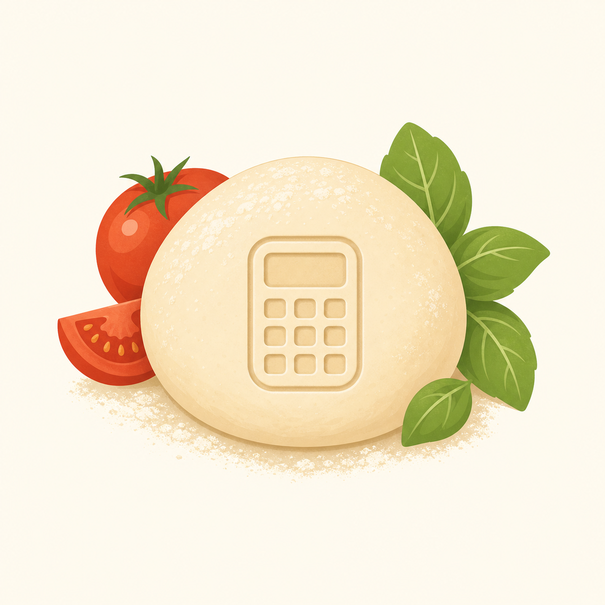

# 🍕 Pizza Dough Calculator

[](https://bmort.github.io/pizza-dough-calculator/)



A small static website for calculating pizza dough ingredient weights. It is built as a single `index.html` file, so it can be hosted directly with GitHub Pages without any build step.

## ✨ Features

- ⚖️ Calculate by dough ball count and ball weight.
- 🎯 Or calculate from a target total dough weight.
- 💧 Set hydration percentage.
- 🫙 Set total poolish weight in grams.
- 🧂 Set salt as a baker's percentage of total flour.
- 📋 See total recipe weights, poolish contribution, and final mix additions.

## 🧮 Calculation Model

The calculator uses baker's percentages against total flour, including flour already present in the poolish.

Poolish is treated as 100% hydration, so the entered poolish weight is split evenly:

- `poolish flour = poolish grams / 2`
- `poolish water = poolish grams / 2`

Given a target dough weight:

```text
hydration = hydration % / 100
saltRate = salt % / 100

totalFlour = targetDough / (1 + hydration + saltRate)
totalWater = totalFlour * hydration
salt = totalFlour * saltRate

finalFlour = totalFlour - poolishFlour
finalWater = totalWater - poolishWater
```

If the poolish is too large for the selected dough size or hydration, the calculator shows a validation message instead of negative ingredient quantities.

## 🖥️ Run Locally

Open `index.html` directly in a browser:

```text
file:///path/to/pizza_dough_calculator/index.html
```

No package install or local server is required.

## 🚀 GitHub Pages

To host from GitHub Pages:

1. Push the repository to GitHub.
2. In the repository settings, open **Pages**.
3. Set the source to deploy from the `main` branch.
4. Use the repository root as the Pages folder.

## 🚧 Scope

Yeast timing and fermentation modelling are intentionally out of scope. This calculator only handles flour, water, poolish, and salt quantities.
